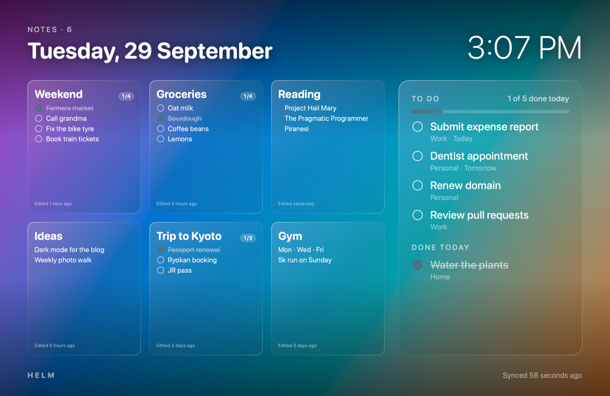

# helm

A macOS screensaver that shows your Apple Notes and Reminders on frosted glass
over a Ken Burns photo slideshow, with a menu bar app that keeps it in sync.



## Install

```sh
brew install --cask jonathanvineet/tap/helm
```

(Plain `brew install helm` installs the unrelated Kubernetes tool.)

Then:

1. **Open Helm.** It lives in the menu bar and starts at login.
2. **System Settings → Screen Saver:** pick Helm.
3. **Grant access** to Reminders, and Full Disk Access so Helm can read Apple Notes.

Helm isn't notarized yet, so the cask clears macOS's download quarantine flag from the app, and the app clears it from the screensaver when it launches.

## Build from source

```sh
./build.sh --install
```

## Watching pages

Helm's browser extension (in [`extension/`](extension/)) watches pages you're
waiting on, like an order, an app review or a visa status, and tells you when
they change. It runs in your normal browser, so pages you're logged in to work.

**Install.** In Brave, open `brave://extensions`, turn on Developer mode, click
Load unpacked and choose the `extension` folder. Then pin the Helm icon.

**Adding a watch.** Select the status text on the page, then click the Helm icon
and choose what to watch for:

- *The selected part changes* (the default) follows that text through every
  stage, like "Arriving Thursday" → "Out for delivery" → "Delivered".
- *Some text disappears from the page* waits for "still waiting" text to go
  away. Separate alternatives with `|`.

Under More options you can say what counts as done (like `Delivered`), limit a
text watch to the part of the page below a heading, and give slow pages longer
to load.

**Examples.**

- Amazon order: open the order details or Track package page (not the order
  list, which reshuffles), select the delivery status, and watch for changes.
  Mark as done when it says `Delivered`.
- Play Console app review: choose *some text disappears* with `Changes in review`.
- LinkedIn API product: select "Review in progress" and watch for changes.

**On the screensaver.** Watches also appear in the board's Waiting on panel.
Helm.app registers itself with Brave and Chrome at launch, and the extension
hands it the watch list (over native messaging, which stays on your Mac)
whenever something changes. Turn the panel off in Customize → Watched pages.

**Badge.** Green shows how many watches have news for you: an update you haven't
seen, a problem, or a finished review. Otherwise amber shows how many are still
being watched. Opening the popup marks updates as seen.

**Phone alerts.** Install the [ntfy](https://ntfy.sh) app, subscribe to a topic
that's hard to guess, and enter the same topic under Settings → Phone alerts.
Send test checks it works. This is the extension's only network request.

**Limits.**

- The browser has to be running for checks to happen.
- Pages you already have open are checked in their tab, which reloads in the
  background (unless it's the tab you're looking at). Pages that aren't open
  are loaded in a minimized window that closes when the check is done.
- A site redesign can break a selected-text watch. It then shows "(no longer on
  the page)"; add the watch again.
- Don't select text that changes by itself, like "updated 5 min ago".
- Keep the interval at 30 minutes or more.

**Tests** (dev only):

```sh
cd tests/extension && npm install && npx playwright install chromium && npm test
```

## Screenshot

`docs/screenshot.png` is drawn from the demo board, not your own notes:

```sh
build/helm-render docs/screenshot.png 5 "" docs/demo-board.json
```

Pass a photo path instead of `""` to render over a photo.

## Release

```sh
./release.sh 0.3.0
```

This writes `dist/Helm-0.3.0.zip` and `dist/helm.rb`. Upload the zip to a GitHub
release tagged `v0.3.0`, then copy `helm.rb` to `Casks/helm.rb` in
[jonathanvineet/homebrew-tap](https://github.com/jonathanvineet/homebrew-tap).
